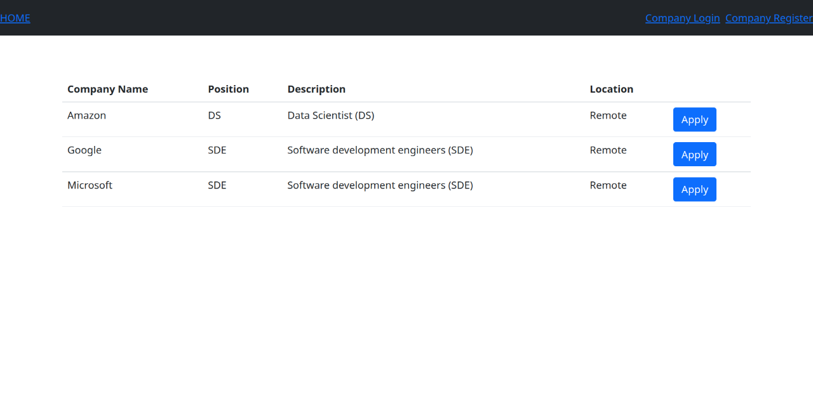

# Aggie Job Referral

## How to make the project run locally
0. Install WSL (windows only)
1. Install git, python, and pip
2. git clone https://github.com/aggie-coding-club/aggie-job-referral
3. cd aggie-job-referral
4. git checkout forum
5. pip install -r requirements.txt
6. python manage.py migrate --run-syncdb
7. python manage.py loaddata dump.json
8. python manage.py runserver
9. Open the url 127.0.0.1:8000 (or any url returned by the prompt)

* You may need to create a .env file in  aggie-job-referral/ (or AggieJobReferral/) with the content like,
```
SECRET_KEY=AAAABBBBCCCCDDDD12341234=
```
where SECRET_KEY should end with =

 DO NOT share the key with anyone.
Try this online key generator [CodeIgniter Encryption Keys](https://randomkeygen.com/#ci_key), then add an equal sign at the end.

If everthing works, you should be able to see this



## Django admin
1. Create an admin by `python manage.py createsuperuser`
2. Go to 127.0.0.1:8000/admin then enter the credentials
3. Enjoy the ***power*** of an admin

see details at [creating-an-admin-user](https://docs.djangoproject.com/en/4.0/intro/tutorial02/#creating-an-admin-user)


## Todos
- [ ] Build dashboard for company and candidate
- [ ] Email notification
- [ ] Test deploy on heroku


## **Before Deploy on heroku**
- [ ] Security check
- [ ] change LOCAL_RUNNING in AggieJobReferral/settings.py to False